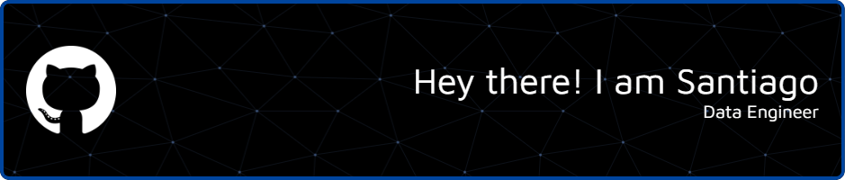

---

  

 

	
## <picture></picture> **About me**

 

I am a Data Engineer who turned his passion for computers into a career and lifestyle. I like to turn difficult tasks into easy tasks to make them an enjoyable job. I love turning raw data into actionable insights. I’ve honed my skills in ETL processes, data warehousing, and cloud technologies including AWS. 

  

  

## <b> Skills</b>
 

- **Languages**:
    
    
    

    

- **Libraries**

	
	
 	
 	
	
	
	

 

- **Cloud**

	
	
	
	
	

 

- **Big Data**:

	
	
	
	
	
	

 

- **Databases**

	
	
	

 

- **Softwares and Tools**:

    
    
    
	

 

- **Extras**:

    
       
	

 
 

 

## <b> Github Stats</b>
 

 
 
 

 
 

## <b> Let's Connect!</b>
 

<ul>

<li>

</li>

 

<li>

</li>
	
</ul>

 

 
 
 
